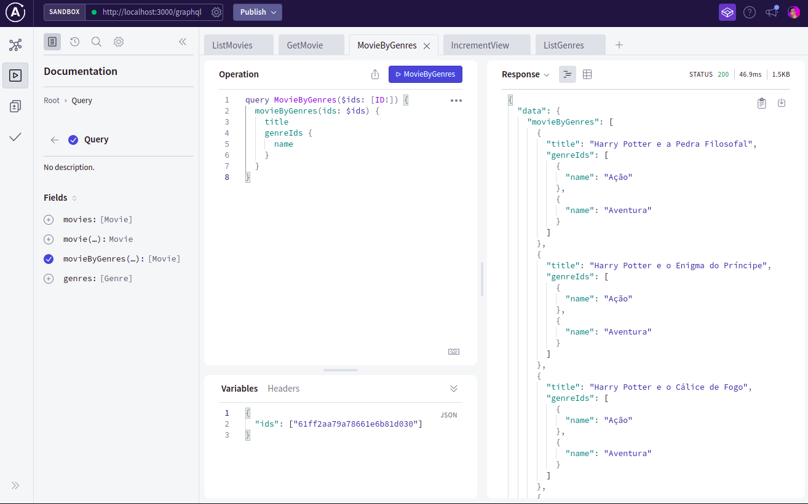

# Movie DB - Graphql & Mongodb

It's a very simple training graphql api that provide a movie's information. This project is an application of knowledge obtained in Odyssey Apollo Associate certification.

This application use MongoDB and Graphql with best practices referenced on development and have 100% of test coverage. In the future, I will change this app to use typescript.

The movie db is like a name, just list a catalog of movie with some information, for example: original language, original title, overview, popularity, poster image, backdrop image, release date, title, trailer, vote average, vote count, number of page views and genres.

## How to use

### Requirements
- Docker
- Node 16
- MongoDB Compass

> ### Step 1 - Setup
1. Clone this repo `git clone git@github.com:bvaledev/movie-db-graphql-mongo.git`
2. Open project folder and run `npm install`
3. Run docker services with `docker-compose up -d`

> ### Step 2 - Data import
1. Open MongoDB Compass and connect to mongodb container using `mongodb://localhost:27017`
2. Create a database named `movie-catalog`
3. MongoDB Compass inside a database, create two collections, `genres` and `movies`
4. Inside project folder have a folder named `database-collections`, import data to database with the json files inside this folder

> ### Final
1. Access `http://localhost:3000/graphql` to open the Apollo Studio Explorer
